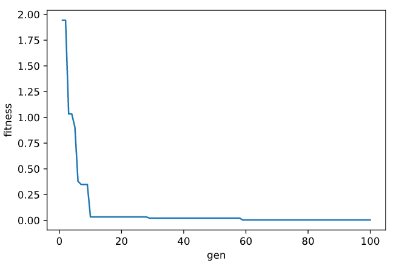
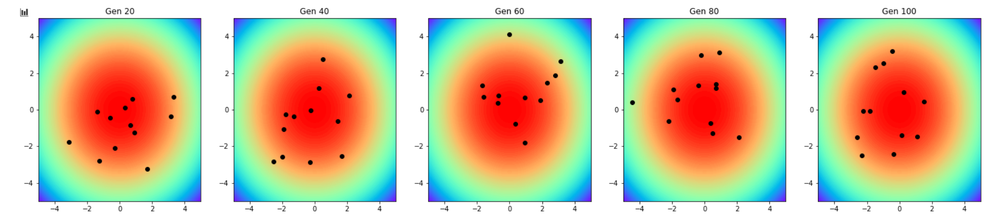

### 示例

* ES (mu,lambda) 策略
  * [nbviewer](https://nbviewer.jupyter.org/github/a2htray/pyes/blob/main/scripts/ipynbs/es_comma.ipynb)
  * [Github](./scripts/ipynbs/es_comma.ipynb)
* ES (mu+lambda) 策略
  * [nbviewer](https://nbviewer.jupyter.org/github/a2htray/pyes/blob/main/scripts/ipynbs/es_plus.ipynb)
  * [Github](./scripts/ipynbs/es_plus.ipynb)

上述示例中，唯一的不同在于 `In [4]:` 中的 `pyes.MU_COMMA_LAMBDA` 和 `pyes.MU_PLUS_LAMBDA`。 

* NES
  * [nbviewer](https://nbviewer.jupyter.org/github/a2htray/pyes/blob/main/scripts/ipynbs/nes.ipynb)
  * [Github](./scripts/ipynbs/nes.ipynb)

PS: 存在一个问题 `nbviewer` 无法加载 `scripts/nes.ipynb` 文件，建议下载该文件再进行预览。

文件部分内容：

`适应值曲线`

`种群分布图`

* 基于 NES 的特征选择方法`单种群`
  * [nbviewer](https://nbviewer.jupyter.org/github/a2htray/pyes/blob/main/scripts/ipynbs/mcc_nes_for_fs_single.ipynb)
  * [Github](./scripts/ipynbs/mcc_nes_for_fs_single.ipynb)

### 资料

1. [维基百科 ES](https://en.wikipedia.org/wiki/Evolution_strategy)
2. [ES 的 Python 实现](https://machinelearningmastery.com/evolution-strategies-from-scratch-in-python/)
3. [维基百科 CMA-ES](https://en.wikipedia.org/wiki/CMA-ES)
4. [The CMA Evolution Strategy: A Tutorial](https://arxiv.org/abs/1604.00772)
5. [NES 视频讲解](https://www.bilibili.com/video/av16926245?p=10)
6. [NES 代码实现](https://github.com/MorvanZhou/Evolutionary-Algorithm/blob/master/tutorial-contents/Evolution%20Strategy/Natural%20Evolution%20Strategy%20(NES).py)
